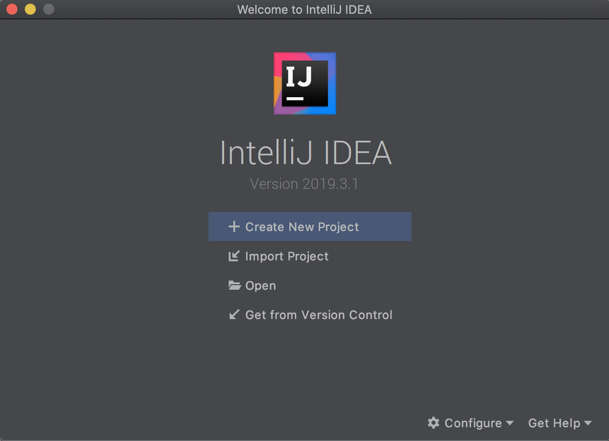
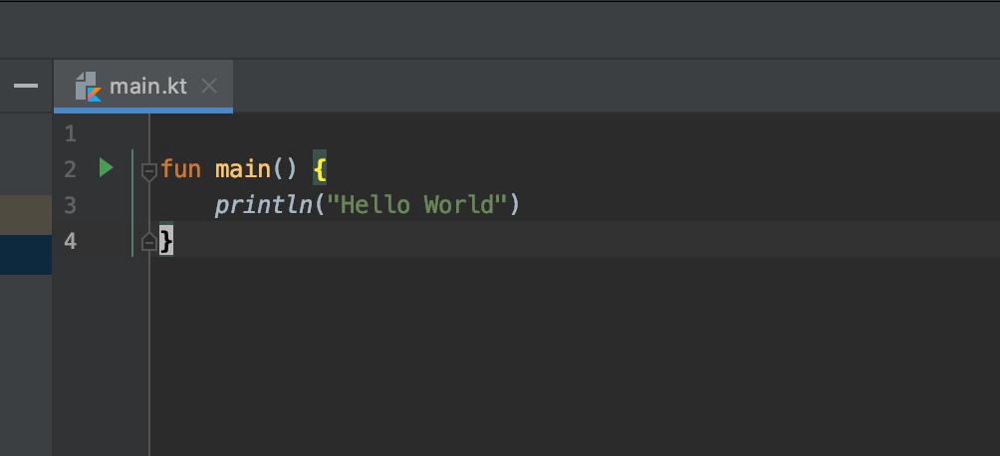
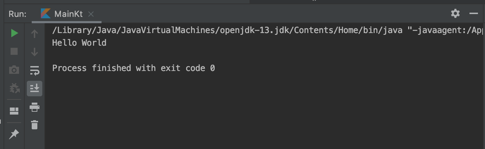

Before diving into the actual syntax and details of programming with Kotlin, first we need to get an environment setup and lay the groundwork. For this series I am going to be using a couple of different tools, and so we might as well get those all setup and configured now! This will be relatively Mac-centric because that is what I use, but I will try and provide links to alternative options for Windows users whenever possible.

## IntelliJ

First up is the IDE we will be using for any and all non-android development. There are a couple of options out there (eclipse is the other big one), but personally I am partial to the IDEA suite of tools, so I will be using IntelliJ Community Edition for this series. 

To get it setup, start by going to [https://www.jetbrains.com/idea/download/](https://www.jetbrains.com/idea/download/) and downloading the Community version. Once that is done install it from the dmg or exe (depending on platform), and start it up. Assuming you don't have any settings to migrate over, continue with the 'Do not import settings' option, and follow the wizard to configure IntelliJ to fit your preferences. In case you want the same setup as me, the options I have selected are as follows:

- UI Theme: Darcula
- Launcher Script: Nothing configured
- Default Plugins: Nothing changed
- Featured Plugins: IdeaVim installed and enabled. Only enable this if you are familiar with vim!!!

Congrats, you have installed and configured your IDE!

Throughout this series I want to give tips and tricks on how best to take advantage of the tools, so expect occasional sidebars describing how to perform a refactor, or how to quickly create a new class, etc... Because I use Vim these might not always be the standard approach, but I will try to give the IdeaVim version as well as the standard version whenever possible. 

## Homebrew

Homebrew is basically a must have tool for developers on Mac. It is a package manager similar to apt-get or pacman on linux, and it allows you to easily install and manage a bunch of different utilities and apps on Mac. Whenever there is something that needs installing, my first approach is always to check Homebrew.

Installing Homebrew is super simple. Go to [https://brew.sh/](https://brew.sh/), copy the Install string, and paste that into your terminal. Follow the steps and you should be good to go!

**Windows Alternative:** There is a tool called Chocolatey that is a similar sort of package/app manager. I haven't used it extensively, and from what I understand it isn't nearly as good and well established as homebrew, but if you want to check it out, go to [https://chocolatey.org/](https://chocolatey.org/).

## Git

Throughout this series I want to ensure that we are using at least some semblance of best practices from the get go, which definitely includes using Git. Throughout this series I will be trying to make regular commits, decent commit messages, and generally do a better job with version control than I normally do. If you are already a heavy version control user, you can probably disregard most of this and just do your thing, but I'm hoping to demonstrate a reasonably good workflow that will help all of us establish better version control habits.

Depending on your environment Git may already be installed. You can check this with the following:

    $ git --version
    git version 2.21.0 (Apple Git-122.2)

If a version is installed, you can skip the next steps if you want, although Apple tends to lag behind on the versions of software they ship, so it might be worthwhile to install your own copy anyway.

To install Git we will be taking advantage of the newly installed Homebrew! Simply go to your terminal, and enter:

    $ brew install git
    $ git --version
    git version 2.24.1

If brew succeeds and the version is returned, you should be good to go.

At this point there is a little bit of configuration you will want to perform as well to make sure that things work properly. The next two commands will be to set your name and email address, so of course simply replace the ones listed with your own. This will set them globally for all repositories, and this information will be attached when you commit to identify yourself.

    $ git config --global user.name "Aengus Finn"
    $ git config --global user.email "me@aengusfinn.com"

**Alternative Approach:** If you are on Windows, or simply don't want to use Homebrew, you can go to [https://git-scm.com/downloads](https://git-scm.com/downloads) and install it manually.

## Project Setup

Now that we have a basic environment configured, it's time to get started coding. For this part we will just get a very basic Hello World project setup and running and committed to Git. 

To begin with, select Create New Project in IntelliJ, select Kotlin in the sidebar, and then JVM | IDEA on the top of the list. Pick a name for the project (i'm going with Project1 for now), and a location for it (for this project ~/dev/teaching/kotlin/project1), and then finish.

Once the project has been created, expand the project in the sidebar, right click on the src folder, and create New→Kotlin File/Class, and name it main.kt. This will create an empty file that will be the entry point for this project.

Paste the following contents into the file, don't worry about what it does for now, I will get into the basics in the next part, for now we just need something to run.

    fun main() {
        println("Hello World")
    }

Once this has been pasted in, you should see a little green arrow to the left of the 'fun main()' line. Click on this and select Run 'MainKt'. A panel will open at the bottom, and you should see the words 'Hello World' print out.

Congratulations, you have built and run a Kotlin program!

## Git Committed

Finally, it's time to get this committed to version control. This isn't a super complicated process, but there are a few steps to follow, especially when doing initial repo setup.

The first thing to take care of is creating a .gitignore file. For those unfamiliar with git, this file allows you to exclude files from being tracked. This is necessary for build output files, and other files that are generated either by the OS, the IDE, or by compilation. 

Although you can create this file manually, and in many cases that will be the way to go, the easiest way to get started is probably just to go to [gitignore.io](http://gitignore.io), enter in a few tokens related to your project (in my case Kotlin, Intellij, and macOS), and copy the output into a file called .gitignore in the root of your project folder. 

Once that is done you are ready to create the repository and commit this initial code. I won't go into the full details of how git works here, so for now just navigate in your terminal to your project folder and enter these commands and you will be done. 

    $ git init
    $ git add .
    $ git commit -m "Initial Commit"

## Next Time

And with that you have a working environment and a Kotlin project built, running, and checked in to Git. Next time I will cover some basics of Kotlin syntax, introducing concepts in support of a project a bit more complex than Hello World. In support of that I will also go over the project, and discuss a development/git workflow we will be following. See you then!